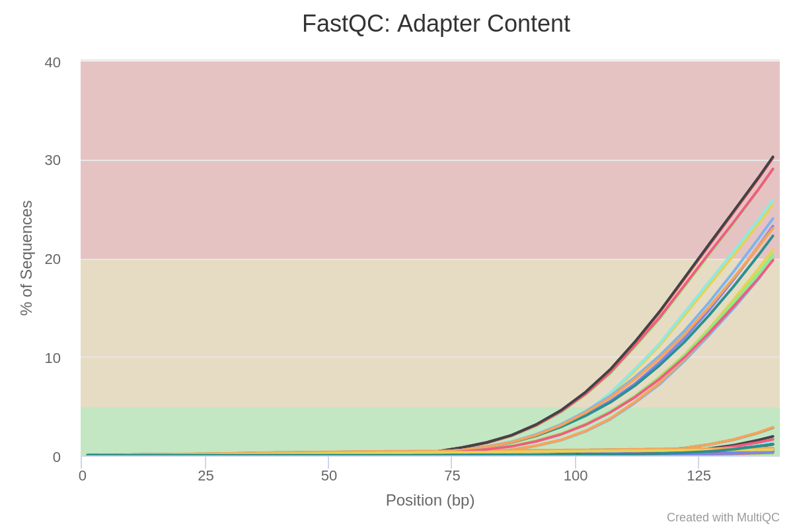
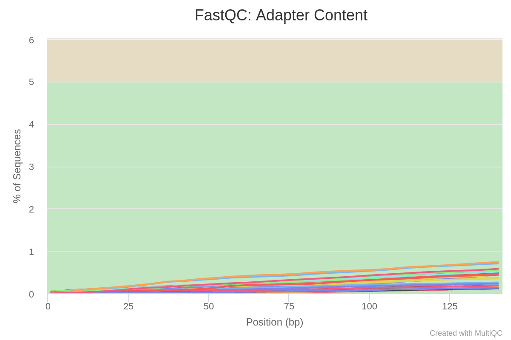

Implementation homework for transcriptomics

Build status

As discribed in task:

1. performed fastqc

2. performed multiqc

3. trimmed barcodes

4. performed fastqc on trimmed 

5. performed multiqc on trimmed

the biggest indicator of succesful removal of adapters is Adapter content plot:

Before trimming            |  after trimming
:-------------------------:|:-------------------------:
  |  

6. Used STAR aliger

7. indexed bam with samtools index, and featureCounts

here we specify strandness:

0 not stranded

1 stranded

2 reversly stranded

Collibri is stranded, therefore 1

KAPA is reversly stranded, therefore 2

8. Used DESeq2 to perform DE analysis comparing UHRRvsHBR:

as a result obtained DE genes with padj values:

For collibri

and KAPA

also volkano plots:

for collibri:

and KAPA:

it has Snakemake file, which will create plot

9. performed PCA using DE genes:

plot for collibri:

and kapa:

it is clear that HBR and UHRR are separeted into 2 different clusters.

more details and figures in separate deseq2.md

10,11: performed gsea using fgsea.

we should use shrunked fold changes

performing on Reactome pathways did not gave promising results, so performed on KEGG pathways.

Collibri provided slightly better(has smaller padj value) results then KAPA but found similar pathways:

some pathways were related to cancer:

KEGG_BASAL_CELL_CARCINOMA

KEGG_COLORECTAL_CANCER

KEGG_ENDOMETRIAL_CANCER

KEGG_WNT_SIGNALING_PATHWAY

KEGG_PATHWAYS_IN_CANCER

KEGG_REGULATION_OF_ACTIN_CYTOSKELETON

collibri:

kappa:

here is DAG of snakemake workflow:

