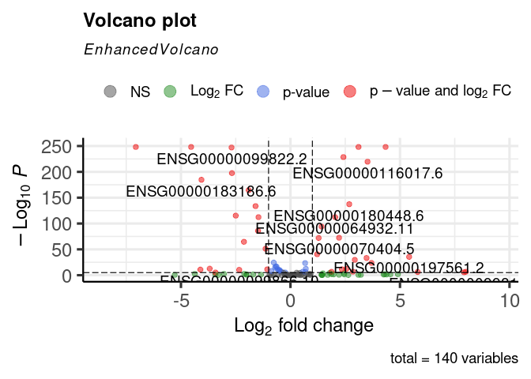

DESeq2 and DE
================
2023-05-02

## R Markdown

``` r
library(DESeq2)
```

    ## Loading required package: S4Vectors

    ## Loading required package: stats4

    ## Loading required package: BiocGenerics

    ## Loading required package: parallel

    ## 
    ## Attaching package: 'BiocGenerics'

    ## The following objects are masked from 'package:parallel':
    ## 
    ##     clusterApply, clusterApplyLB, clusterCall, clusterEvalQ,
    ##     clusterExport, clusterMap, parApply, parCapply, parLapply,
    ##     parLapplyLB, parRapply, parSapply, parSapplyLB

    ## The following objects are masked from 'package:stats':
    ## 
    ##     IQR, mad, sd, var, xtabs

    ## The following objects are masked from 'package:base':
    ## 
    ##     anyDuplicated, append, as.data.frame, basename, cbind, colnames,
    ##     dirname, do.call, duplicated, eval, evalq, Filter, Find, get, grep,
    ##     grepl, intersect, is.unsorted, lapply, Map, mapply, match, mget,
    ##     order, paste, pmax, pmax.int, pmin, pmin.int, Position, rank,
    ##     rbind, Reduce, rownames, sapply, setdiff, sort, table, tapply,
    ##     union, unique, unsplit, which.max, which.min

    ## 
    ## Attaching package: 'S4Vectors'

    ## The following object is masked from 'package:base':
    ## 
    ##     expand.grid

    ## Loading required package: IRanges

    ## Loading required package: GenomicRanges

    ## Loading required package: GenomeInfoDb

    ## Loading required package: SummarizedExperiment

    ## Loading required package: MatrixGenerics

    ## Loading required package: matrixStats

    ## 
    ## Attaching package: 'MatrixGenerics'

    ## The following objects are masked from 'package:matrixStats':
    ## 
    ##     colAlls, colAnyNAs, colAnys, colAvgsPerRowSet, colCollapse,
    ##     colCounts, colCummaxs, colCummins, colCumprods, colCumsums,
    ##     colDiffs, colIQRDiffs, colIQRs, colLogSumExps, colMadDiffs,
    ##     colMads, colMaxs, colMeans2, colMedians, colMins, colOrderStats,
    ##     colProds, colQuantiles, colRanges, colRanks, colSdDiffs, colSds,
    ##     colSums2, colTabulates, colVarDiffs, colVars, colWeightedMads,
    ##     colWeightedMeans, colWeightedMedians, colWeightedSds,
    ##     colWeightedVars, rowAlls, rowAnyNAs, rowAnys, rowAvgsPerColSet,
    ##     rowCollapse, rowCounts, rowCummaxs, rowCummins, rowCumprods,
    ##     rowCumsums, rowDiffs, rowIQRDiffs, rowIQRs, rowLogSumExps,
    ##     rowMadDiffs, rowMads, rowMaxs, rowMeans2, rowMedians, rowMins,
    ##     rowOrderStats, rowProds, rowQuantiles, rowRanges, rowRanks,
    ##     rowSdDiffs, rowSds, rowSums2, rowTabulates, rowVarDiffs, rowVars,
    ##     rowWeightedMads, rowWeightedMeans, rowWeightedMedians,
    ##     rowWeightedSds, rowWeightedVars

    ## Loading required package: Biobase

    ## Welcome to Bioconductor
    ## 
    ##     Vignettes contain introductory material; view with
    ##     'browseVignettes()'. To cite Bioconductor, see
    ##     'citation("Biobase")', and for packages 'citation("pkgname")'.

    ## 
    ## Attaching package: 'Biobase'

    ## The following object is masked from 'package:MatrixGenerics':
    ## 
    ##     rowMedians

    ## The following objects are masked from 'package:matrixStats':
    ## 
    ##     anyMissing, rowMedians

``` r
library(ggplot2)
```

``` r
countFiles <- c("/home/jaro/projects/transcriptomics/homework/results/Collibri_standard_protocol-HBR-Collibri-100_ng-2_S1_L001.featureCounts", 
                "/home/jaro/projects/transcriptomics/homework/results/Collibri_standard_protocol-HBR-Collibri-100_ng-3_S2_L001.featureCounts", 
                "/home/jaro/projects/transcriptomics/homework/results/Collibri_standard_protocol-UHRR-Collibri-100_ng-2_S3_L001.featureCounts",
                "/home/jaro/projects/transcriptomics/homework/results/Collibri_standard_protocol-UHRR-Collibri-100_ng-3_S4_L001.featureCounts")

countDataList <- lapply(countFiles, function(file) {
  # Read the data from the file
  data <- read.table(file, header=TRUE, sep="", stringsAsFactors=FALSE)
  # Extract the count data from the last column
  counts <- data[,ncol(data)]
  # Return the count data as a named vector
  setNames(counts, data$Geneid)
})
```

``` r
countFilesKAPA <- c("/home/jaro/projects/transcriptomics/homework/results/KAPA_mRNA_HyperPrep_-HBR-KAPA-100_ng_total_RNA-2_S5_L001.featureCounts", 
                "/home/jaro/projects/transcriptomics/homework/results/KAPA_mRNA_HyperPrep_-HBR-KAPA-100_ng_total_RNA-3_S6_L001.featureCounts", 
                "/home/jaro/projects/transcriptomics/homework/results/KAPA_mRNA_HyperPrep_-UHRR-KAPA-100_ng_total_RNA-2_S7_L001.featureCounts",
                "/home/jaro/projects/transcriptomics/homework/results/KAPA_mRNA_HyperPrep_-UHRR-KAPA-100_ng_total_RNA-3_S8_L001.featureCounts")

countDataListKAPA <- lapply(countFilesKAPA, function(file) {
  # Read the data from the file
  data <- read.table(file, header=TRUE, sep="", stringsAsFactors=FALSE)
  # Extract the count data from the last column
  counts <- data[,ncol(data)]
  # Return the count data as a named vector
  setNames(counts, data$Geneid)
})
```

``` r
countData <- do.call(cbind, countDataList)

# Set the column names of the data frame
colnames(countData) <- c("HBR_ng2_s1", "HBR_ng3_s2", "UHRR_ng2_s3", "UHRR_ng3_s4")
colData <- data.frame(
  row.names = colnames(countData),
  condition = c("HBR", "HBR", "UHRR", "UHRR"),
  replicate = c(1, 2, 1, 2)
)
```

``` r
countDataKAPA <- do.call(cbind, countDataListKAPA)

# Set the column names of the data frame
colnames(countDataKAPA) <- c("HBR_s5", "HBR_s6", "UHRR_s7", "UHRR_s8")
colDataKAPA <- data.frame(
  row.names = colnames(countDataKAPA),
  condition = c("HBR", "HBR", "UHRR", "UHRR"),
  replicate = c(1, 2, 1, 2)
)
```

``` r
rownames(countData) <- names(countDataList[[1]])
rownames(colData) <- colnames(countData)

condition <- factor(c("HBR", "HBR", "UHRR", "UHRR"))

condicolData <- data.frame(row.names=colnames(countData), condition)

#countData <- countData[which(rowSums(countData) > 50),]

data <- as.data.frame(countData)
```

``` r
rownames(countDataKAPA) <- names(countDataListKAPA[[1]])
rownames(colDataKAPA) <- colnames(countDataKAPA)

condition <- factor(c("HBR", "HBR", "UHRR", "UHRR"))

condicolDataKAPA <- data.frame(row.names=colnames(countDataKAPA), condition)

#countDataKAPA <- countDataKAPA[which(rowSums(countDataKAPA) > 50),]

dataKAPA <- as.data.frame(countDataKAPA)
```

``` r
dds <- DESeqDataSetFromMatrix(countData = countData,
                              colData = colData,
                              design = ~condition)
```

    ## Warning in DESeqDataSet(se, design = design, ignoreRank): some variables in
    ## design formula are characters, converting to factors

``` r
dds <- DESeq(dds)
```

    ## estimating size factors

    ## estimating dispersions

    ## gene-wise dispersion estimates

    ## mean-dispersion relationship

    ## -- note: fitType='parametric', but the dispersion trend was not well captured by the
    ##    function: y = a/x + b, and a local regression fit was automatically substituted.
    ##    specify fitType='local' or 'mean' to avoid this message next time.

    ## final dispersion estimates

    ## fitting model and testing

``` r
dds$condition <- factor(dds$condition, levels = c("HBR","UHRR"))
res <- results(dds, name = "condition_UHRR_vs_HBR")
```

``` r
ddsKAPA <- DESeqDataSetFromMatrix(countData = countDataKAPA,
                              colData = colDataKAPA,
                              design = ~condition)
```

    ## Warning in DESeqDataSet(se, design = design, ignoreRank): some variables in
    ## design formula are characters, converting to factors

``` r
ddsKAPA <- DESeq(ddsKAPA)
```

    ## estimating size factors

    ## estimating dispersions

    ## gene-wise dispersion estimates

    ## mean-dispersion relationship

    ## -- note: fitType='parametric', but the dispersion trend was not well captured by the
    ##    function: y = a/x + b, and a local regression fit was automatically substituted.
    ##    specify fitType='local' or 'mean' to avoid this message next time.

    ## final dispersion estimates

    ## fitting model and testing

``` r
ddsKAPA$condition <- factor(ddsKAPA$condition, levels = c("HBR","UHRR"))
resKAPA <- results(ddsKAPA, name = "condition_UHRR_vs_HBR")
```

``` r
resLFC <- lfcShrink(dds, coef="condition_UHRR_vs_HBR", type="apeglm")
```

    ## using 'apeglm' for LFC shrinkage. If used in published research, please cite:
    ##     Zhu, A., Ibrahim, J.G., Love, M.I. (2018) Heavy-tailed prior distributions for
    ##     sequence count data: removing the noise and preserving large differences.
    ##     Bioinformatics. https://doi.org/10.1093/bioinformatics/bty895

``` r
resLFC
```

    ## log2 fold change (MAP): condition UHRR vs HBR 
    ## Wald test p-value: condition UHRR vs HBR 
    ## DataFrame with 140 rows and 5 columns
    ##                     baseMean log2FoldChange     lfcSE       pvalue         padj
    ##                    <numeric>      <numeric> <numeric>    <numeric>    <numeric>
    ## ENSG00000225373.4  193.91674       0.345914  0.264618     0.176136     0.237579
    ## ENSG00000267588.2   17.16432      -0.491124  0.650834     0.333842     0.398854
    ## ENSG00000233630.4    8.08778      -0.432133  0.815945     0.412886     0.469556
    ## ENSG00000266945.2    0.00000             NA        NA           NA           NA
    ## ENSG00000267310.1    0.00000             NA        NA           NA           NA
    ## ...                      ...            ...       ...          ...          ...
    ## ENSG00000213638.4    153.795      0.7604570 0.3119861  1.03048e-02  1.81114e-02
    ## ENSG00000198683.2      0.000             NA        NA           NA           NA
    ## ENSG00000133275.11  4691.274      0.0331733 0.0703554  6.37124e-01  7.03870e-01
    ## ENSG00000180846.4      0.000             NA        NA           NA           NA
    ## ENSG00000133243.4   6807.284     -1.4553673 0.0645607 5.09979e-113 4.20961e-112

``` r
resOrdered <- res[order(res$pvalue),]

sum(res$padj < 0.05, na.rm=TRUE)
```

    ## [1] 72

``` r
res05 <- results(dds, alpha=0.05)
summary(res05)
```

    ## 
    ## out of 116 with nonzero total read count
    ## adjusted p-value < 0.05
    ## LFC > 0 (up)       : 40, 34%
    ## LFC < 0 (down)     : 33, 28%
    ## outliers [1]       : 0, 0%
    ## low counts [2]     : 9, 7.8%
    ## (mean count < 2)
    ## [1] see 'cooksCutoff' argument of ?results
    ## [2] see 'independentFiltering' argument of ?results

``` r
sum(res05$padj < 0.05, na.rm=TRUE)
```

    ## [1] 73

``` r
resLFCKAPA <- lfcShrink(ddsKAPA, coef="condition_UHRR_vs_HBR", type="apeglm")
```

    ## using 'apeglm' for LFC shrinkage. If used in published research, please cite:
    ##     Zhu, A., Ibrahim, J.G., Love, M.I. (2018) Heavy-tailed prior distributions for
    ##     sequence count data: removing the noise and preserving large differences.
    ##     Bioinformatics. https://doi.org/10.1093/bioinformatics/bty895

``` r
resLFCKAPA
```

    ## log2 fold change (MAP): condition UHRR vs HBR 
    ## Wald test p-value: condition UHRR vs HBR 
    ## DataFrame with 140 rows and 5 columns
    ##                      baseMean log2FoldChange     lfcSE      pvalue        padj
    ##                     <numeric>      <numeric> <numeric>   <numeric>   <numeric>
    ## ENSG00000225373.4    107.2475     -0.0965915  0.336496    0.759002    0.792164
    ## ENSG00000267588.2     21.6164     -0.5269744  0.587867    0.275040    0.322751
    ## ENSG00000233630.4      3.3945     -0.4091662  0.994757    0.353095    0.402039
    ## ENSG00000266945.2      0.0000             NA        NA          NA          NA
    ## ENSG00000267310.1      0.0000             NA        NA          NA          NA
    ## ...                       ...            ...       ...         ...         ...
    ## ENSG00000213638.4    62.53507       0.235493 0.4033518 5.26749e-01 0.576915292
    ## ENSG00000198683.2     0.00000             NA        NA          NA          NA
    ## ENSG00000133275.11 4032.89078       0.199261 0.0507805 8.55104e-05 0.000161208
    ## ENSG00000180846.4     0.63562      -0.128009 1.0270650 5.18159e-01          NA
    ## ENSG00000133243.4  8316.29118      -1.348220 0.0350923 0.00000e+00 0.000000000

``` r
resOrderedKAPA <- resKAPA[order(resKAPA$pvalue),]

sum(resKAPA$padj < 0.05, na.rm=TRUE)
```

    ## [1] 79

``` r
res05KAPA <- results(ddsKAPA, alpha=0.05)
summary(res05KAPA)
```

    ## 
    ## out of 120 with nonzero total read count
    ## adjusted p-value < 0.05
    ## LFC > 0 (up)       : 42, 35%
    ## LFC < 0 (down)     : 38, 32%
    ## outliers [1]       : 0, 0%
    ## low counts [2]     : 7, 5.8%
    ## (mean count < 2)
    ## [1] see 'cooksCutoff' argument of ?results
    ## [2] see 'independentFiltering' argument of ?results

``` r
sum(res05KAPA$padj < 0.05, na.rm=TRUE)
```

    ## [1] 80

``` r
library("IHW")
```

    ## 
    ## Attaching package: 'IHW'

    ## The following object is masked from 'package:ggplot2':
    ## 
    ##     alpha

``` r
resIHW <- results(dds, filterFun=ihw)
```

    ## Only 1 bin; IHW reduces to Benjamini Hochberg (uniform weights)

``` r
summary(resIHW)
```

    ## 
    ## out of 116 with nonzero total read count
    ## adjusted p-value < 0.1
    ## LFC > 0 (up)       : 44, 38%
    ## LFC < 0 (down)     : 37, 32%
    ## outliers [1]       : 0, 0%
    ## [1] see 'cooksCutoff' argument of ?results
    ## see metadata(res)$ihwResult on hypothesis weighting

``` r
sum(resIHW$padj < 0.1, na.rm=TRUE)
```

    ## [1] 81

``` r
metadata(resIHW)$ihwResult
```

    ## ihwResult object with 140 hypothesis tests 
    ## Nominal FDR control level: 0.1 
    ## Split into 1 bins, based on an ordinal covariate

``` r
plotMA(res, ylim=c(-2,2))
```

<!-- -->

``` r
plotMA(resLFC, ylim=c(-2,2))
```

<!-- -->

``` r
resIHWKAPA <- results(ddsKAPA, filterFun=ihw)
```

    ## Only 1 bin; IHW reduces to Benjamini Hochberg (uniform weights)

``` r
summary(resIHWKAPA)
```

    ## 
    ## out of 120 with nonzero total read count
    ## adjusted p-value < 0.1
    ## LFC > 0 (up)       : 44, 37%
    ## LFC < 0 (down)     : 40, 33%
    ## outliers [1]       : 0, 0%
    ## [1] see 'cooksCutoff' argument of ?results
    ## see metadata(res)$ihwResult on hypothesis weighting

``` r
sum(resIHWKAPA$padj < 0.1, na.rm=TRUE)
```

    ## [1] 84

``` r
metadata(resIHWKAPA)$ihwResult
```

    ## ihwResult object with 140 hypothesis tests 
    ## Nominal FDR control level: 0.1 
    ## Split into 1 bins, based on an ordinal covariate

``` r
plotMA(resKAPA, ylim=c(-2,2))
```

<!-- -->

``` r
plotMA(resLFCKAPA, ylim=c(-2,2))
```

<!-- -->

``` r
resNorm <- lfcShrink(dds, coef=2, type="normal")
```

    ## using 'normal' for LFC shrinkage, the Normal prior from Love et al (2014).
    ## 
    ## Note that type='apeglm' and type='ashr' have shown to have less bias than type='normal'.
    ## See ?lfcShrink for more details on shrinkage type, and the DESeq2 vignette.
    ## Reference: https://doi.org/10.1093/bioinformatics/bty895

``` r
resAsh <- lfcShrink(dds, coef=2, type="ashr")
```

    ## using 'ashr' for LFC shrinkage. If used in published research, please cite:
    ##     Stephens, M. (2016) False discovery rates: a new deal. Biostatistics, 18:2.
    ##     https://doi.org/10.1093/biostatistics/kxw041

``` r
par(mfrow=c(1,3), mar=c(4,4,2,1))
xlim <- c(1,1e5); ylim <- c(-3,3)
plotMA(resLFC, xlim=xlim, ylim=ylim, main="apeglm")
plotMA(resNorm, xlim=xlim, ylim=ylim, main="normal")
plotMA(resAsh, xlim=xlim, ylim=ylim, main="ashr")
```

<!-- -->

``` r
par(mfrow=c(1,1))
```

``` r
resNormKAPA <- lfcShrink(ddsKAPA, coef=2, type="normal")
```

    ## using 'normal' for LFC shrinkage, the Normal prior from Love et al (2014).
    ## 
    ## Note that type='apeglm' and type='ashr' have shown to have less bias than type='normal'.
    ## See ?lfcShrink for more details on shrinkage type, and the DESeq2 vignette.
    ## Reference: https://doi.org/10.1093/bioinformatics/bty895

``` r
resAshKAPA <- lfcShrink(ddsKAPA, coef=2, type="ashr")
```

    ## using 'ashr' for LFC shrinkage. If used in published research, please cite:
    ##     Stephens, M. (2016) False discovery rates: a new deal. Biostatistics, 18:2.
    ##     https://doi.org/10.1093/biostatistics/kxw041

``` r
par(mfrow=c(1,3), mar=c(4,4,2,1))
xlim <- c(1,1e5); ylim <- c(-3,3)
plotMA(resLFCKAPA, xlim=xlim, ylim=ylim, main="apeglm")
plotMA(resNormKAPA, xlim=xlim, ylim=ylim, main="normal")
plotMA(resAshKAPA, xlim=xlim, ylim=ylim, main="ashr")
```

<!-- -->

``` r
par(mfrow=c(1,1))
```

``` r
library("ggplot2")
```

``` r
d <- plotCounts(dds, gene=which.min(res$padj), intgroup="condition", 
                returnData=TRUE)
ggplot(d, aes(x=condition, y=count)) + 
  geom_point(position=position_jitter(w=0.1,h=0)) + 
  scale_y_log10(breaks=c(25,100,400))
```

<!-- -->

``` r
mcols(res)$description
```

    ## [1] "mean of normalized counts for all samples"    
    ## [2] "log2 fold change (MLE): condition UHRR vs HBR"
    ## [3] "standard error: condition UHRR vs HBR"        
    ## [4] "Wald statistic: condition UHRR vs HBR"        
    ## [5] "Wald test p-value: condition UHRR vs HBR"     
    ## [6] "BH adjusted p-values"

``` r
write.csv(as.data.frame(resOrdered), 
          file="condition_treated_results.csv")
resSig <- subset(resOrdered, padj < 0.1)
resSig
```

    ## log2 fold change (MLE): condition UHRR vs HBR 
    ## Wald test p-value: condition UHRR vs HBR 
    ## DataFrame with 81 rows and 6 columns
    ##                     baseMean log2FoldChange     lfcSE      stat       pvalue
    ##                    <numeric>      <numeric> <numeric> <numeric>    <numeric>
    ## ENSG00000099864.13   7754.07       -4.53641 0.0666897  -68.0227  0.00000e+00
    ## ENSG00000011304.12   9532.44        3.10545 0.0685069   45.3305  0.00000e+00
    ## ENSG00000064666.10   3231.78        4.34235 0.1011836   42.9155  0.00000e+00
    ## ENSG00000115266.7   11545.50       -7.06124 0.0879030  -80.3300  0.00000e+00
    ## ENSG00000099822.2    2468.14       -2.69047 0.0800102  -33.6266 6.85329e-248
    ## ...                      ...            ...       ...       ...          ...
    ## ENSG00000266927.2    2.35290       4.253403  2.167063   1.96275    0.0496752
    ## ENSG00000267639.2    9.17344      -2.008901  1.027203  -1.95570    0.0505003
    ## ENSG00000272098.1  219.98656       0.514259  0.264764   1.94233    0.0520974
    ## ENSG00000266990.1    4.31598      -3.430265  1.769943  -1.93806    0.0526153
    ## ENSG00000267092.1    8.41076      -2.012292  1.064552  -1.89027    0.0587217
    ##                            padj
    ##                       <numeric>
    ## ENSG00000099864.13  0.00000e+00
    ## ENSG00000011304.12  0.00000e+00
    ## ENSG00000064666.10  0.00000e+00
    ## ENSG00000115266.7   0.00000e+00
    ## ENSG00000099822.2  1.58996e-246
    ## ...                         ...
    ## ENSG00000266927.2     0.0748353
    ## ENSG00000267639.2     0.0751031
    ## ENSG00000272098.1     0.0762922
    ## ENSG00000266990.1     0.0762922
    ## ENSG00000267092.1     0.0840952

``` r
dKAPA <- plotCounts(ddsKAPA, gene=which.min(resKAPA$padj), intgroup="condition", 
                returnData=TRUE)
ggplot(dKAPA, aes(x=condition, y=count)) + 
  geom_point(position=position_jitter(w=0.1,h=0)) + 
  scale_y_log10(breaks=c(25,100,400))
```

<!-- -->

``` r
mcols(resKAPA)$description
```

    ## [1] "mean of normalized counts for all samples"    
    ## [2] "log2 fold change (MLE): condition UHRR vs HBR"
    ## [3] "standard error: condition UHRR vs HBR"        
    ## [4] "Wald statistic: condition UHRR vs HBR"        
    ## [5] "Wald test p-value: condition UHRR vs HBR"     
    ## [6] "BH adjusted p-values"

``` r
write.csv(as.data.frame(resOrderedKAPA), 
          file="condition_treated_results_kapa.csv")
resSigKAPA <- subset(resOrderedKAPA, padj < 0.1)
resSigKAPA
```

    ## log2 fold change (MLE): condition UHRR vs HBR 
    ## Wald test p-value: condition UHRR vs HBR 
    ## DataFrame with 87 rows and 6 columns
    ##                     baseMean log2FoldChange     lfcSE      stat    pvalue
    ##                    <numeric>      <numeric> <numeric> <numeric> <numeric>
    ## ENSG00000099822.2    6426.52       -3.38173 0.0498107  -67.8917         0
    ## ENSG00000099864.13  13368.38       -4.48199 0.0380084 -117.9210         0
    ## ENSG00000011304.12  11254.25        3.49924 0.0417067   83.9013         0
    ## ENSG00000116017.6    2141.20        3.88438 0.0989206   39.2676         0
    ## ENSG00000064666.10   5324.45        5.10150 0.0788773   64.6764         0
    ## ...                      ...            ...       ...       ...       ...
    ## ENSG00000267161.1  213.73490       0.598159  0.294880   2.02848 0.0425109
    ## ENSG00000267244.1    9.58595      -1.808140  0.963151  -1.87732 0.0604744
    ## ENSG00000267029.3    5.28343       2.856759  1.587759   1.79924 0.0719808
    ## ENSG00000185198.7    5.30316       2.839114  1.583778   1.79262 0.0730334
    ## ENSG00000266926.1   14.13257       1.405239  0.788527   1.78211 0.0747321
    ##                         padj
    ##                    <numeric>
    ## ENSG00000099822.2          0
    ## ENSG00000099864.13         0
    ## ENSG00000011304.12         0
    ## ENSG00000116017.6          0
    ## ENSG00000064666.10         0
    ## ...                      ...
    ## ENSG00000267161.1  0.0589007
    ## ENSG00000267244.1  0.0827924
    ## ENSG00000267029.3  0.0973858
    ## ENSG00000185198.7  0.0976610
    ## ENSG00000266926.1  0.0987838

``` r
vsd <- varianceStabilizingTransformation(dds, blind=FALSE)
rld <- rlog(dds, blind=FALSE)
head(assay(vsd), 3)
```

    ##                   HBR_ng2_s1 HBR_ng3_s2 UHRR_ng2_s3 UHRR_ng3_s4
    ## ENSG00000225373.4   9.922912   9.920357    9.990595    9.998088
    ## ENSG00000267588.2   9.564730   9.560169    9.514908    9.506762
    ## ENSG00000233630.4   9.405512   9.545955    9.418465    9.468387

``` r
ntd <- normTransform(dds)
library("vsn")
meanSdPlot(assay(ntd))
```

<!-- -->

``` r
meanSdPlot(assay(vsd))
```

<!-- -->

``` r
meanSdPlot(assay(rld))
```

<!-- -->

``` r
vsdKAPA <- varianceStabilizingTransformation(ddsKAPA, blind=FALSE)
rldKAPA <- rlog(ddsKAPA, blind=FALSE)
head(assay(vsdKAPA), 3)
```

    ##                     HBR_s5   HBR_s6  UHRR_s7  UHRR_s8
    ## ENSG00000225373.4 11.09899 11.05156 11.07160 11.06488
    ## ENSG00000267588.2 10.90610 10.96842 10.88624 10.92655
    ## ENSG00000233630.4 10.88534 10.81375 10.83241 10.83276

``` r
ntdKAPA <- normTransform(ddsKAPA)

meanSdPlot(assay(ntdKAPA))
```

<!-- -->

``` r
meanSdPlot(assay(vsdKAPA))
```

<!-- -->

``` r
meanSdPlot(assay(rldKAPA))
```

<!-- -->

``` r
library("pheatmap")
```

``` r
select <- order(rowMeans(counts(dds,normalized=TRUE)),
                decreasing=TRUE)[1:20]
df <- as.data.frame(colData(dds)[,c("condition")])
rownames(df) <- colnames(ntd)
color_palette <- colorRampPalette(c("blue", "white", "red"))(50)
pheatmap(assay(ntd)[select,], cluster_rows=FALSE, show_rownames=FALSE,
         cluster_cols=FALSE, annotation_col=df)
```

<!-- -->

``` r
pheatmap(assay(vsd)[select,], cluster_rows=FALSE, show_rownames=FALSE,
         cluster_cols=FALSE, annotation_col=df)
```

<!-- -->

``` r
pheatmap(assay(rld)[select,], cluster_rows=FALSE, show_rownames=FALSE,
         cluster_cols=FALSE, annotation_col=df)
```

<!-- -->

``` r
sampleDists <- dist(t(assay(vsd)))
```

``` r
selectKAPA <- order(rowMeans(counts(ddsKAPA,normalized=TRUE)),
                decreasing=TRUE)[1:20]
dfKAPA <- as.data.frame(colData(ddsKAPA)[,c("condition")])
rownames(dfKAPA) <- colnames(ntdKAPA)
color_palette <- colorRampPalette(c("blue", "white", "red"))(50)
pheatmap(assay(ntdKAPA)[selectKAPA,], cluster_rows=FALSE, show_rownames=FALSE,
         cluster_cols=FALSE, annotation_col=dfKAPA)
```

<!-- -->

``` r
pheatmap(assay(vsdKAPA)[select,], cluster_rows=FALSE, show_rownames=FALSE,
         cluster_cols=FALSE, annotation_col=dfKAPA)
```

<!-- -->

``` r
pheatmap(assay(rldKAPA)[select,], cluster_rows=FALSE, show_rownames=FALSE,
         cluster_cols=FALSE, annotation_col=dfKAPA)
```

<!-- -->

``` r
sampleDistsKAPA <- dist(t(assay(vsdKAPA)))
```

``` r
library("RColorBrewer")
sampleDistMatrix <- as.matrix(sampleDists)
rownames(sampleDistMatrix) <- paste(vsd$condition, vsd$type, sep="-")
colnames(sampleDistMatrix) <- NULL
colors <- colorRampPalette( rev(brewer.pal(9, "Blues")) )(255)
pheatmap(sampleDistMatrix,
         clustering_distance_rows=sampleDists,
         clustering_distance_cols=sampleDists,
         col=colors)
```

<!-- -->

``` r
sampleDistMatrixKAPA <- as.matrix(sampleDistsKAPA)
rownames(sampleDistMatrixKAPA) <- paste(vsdKAPA$condition, vsdKAPA$type, sep="-")
colnames(sampleDistMatrixKAPA) <- NULL
colorsKAPA <- colorRampPalette( rev(brewer.pal(9, "Blues")) )(255)
pheatmap(sampleDistMatrixKAPA,
         clustering_distance_rows=sampleDistsKAPA,
         clustering_distance_cols=sampleDistsKAPA,
         col=colors)
```

<!-- -->

``` r
pcaData <- plotPCA(vsd, intgroup=c("condition"), returnData=TRUE)
percentVar <- round(100 * attr(pcaData, "percentVar"))
ggplot(pcaData, aes(PC1, PC2, color=condition, shape=condition)) +
  geom_point(size=5) +
  xlab(paste0("PC1: ",percentVar[1],"% variance")) +
  ylab(paste0("PC2: ",percentVar[2],"% variance")) + 
  coord_fixed(ratio=8)
```

<!-- -->

``` r
pcaDataKAPA <- plotPCA(vsdKAPA, intgroup=c("condition"), returnData=TRUE)
percentVarKAPA <- round(100 * attr(pcaDataKAPA, "percentVar"))
ggplot(pcaDataKAPA, aes(PC1, PC2, color=condition, shape=condition)) +
  geom_point(size=5) +
  xlab(paste0("PC1: ",percentVar[1],"% variance")) +
  ylab(paste0("PC2: ",percentVar[2],"% variance")) + 
  coord_fixed(ratio=8)
```

<!-- -->

``` r
library(EnhancedVolcano)
```

    ## Loading required package: ggrepel

    ## Registered S3 methods overwritten by 'ggalt':
    ##   method                  from   
    ##   grid.draw.absoluteGrob  ggplot2
    ##   grobHeight.absoluteGrob ggplot2
    ##   grobWidth.absoluteGrob  ggplot2
    ##   grobX.absoluteGrob      ggplot2
    ##   grobY.absoluteGrob      ggplot2

``` r
  EnhancedVolcano(res,
    lab = rownames(res),
    x = 'log2FoldChange',
    y = 'pvalue',
    selectLab = c('VCAM1','KCTD12','ADAM12',
      'CXCL12','CACNB2','SPARCL1','DUSP1','SAMHD1','MAOA'),
    xlab = bquote(~Log[2]~ 'fold change'),
    pCutoff = 10e-14,
    FCcutoff = 2.0,
    pointSize = 4.0,
    labSize = 6.0,
    labCol = 'black',
    labFace = 'bold',
    boxedLabels = TRUE,
    colAlpha = 4/5,
    legendPosition = 'right',
    legendLabSize = 14,
    legendIconSize = 4.0,
    drawConnectors = TRUE,
    widthConnectors = 1.0,
    colConnectors = 'black')
```

    ## Warning: One or more p-values is 0. Converting to 10^-1 * current lowest
    ## non-zero p-value...

<!-- -->

``` r
  EnhancedVolcano(resKAPA,
    lab = rownames(resKAPA),
    x = 'log2FoldChange',
    y = 'pvalue',
    xlab = bquote(~Log[2]~ 'fold change'),
    pCutoff = 10e-14,
    FCcutoff = 2.0,
    pointSize = 4.0,
    labSize = 2.0,
    labCol = 'black',
    labFace = 'bold',
    boxedLabels = TRUE,
    colAlpha = 4/5,
    legendPosition = 'right',
    legendLabSize = 14,
    legendIconSize = 4.0,
    drawConnectors = TRUE,
    widthConnectors = 1.0,
    colConnectors = 'black')
```

    ## Warning: One or more p-values is 0. Converting to 10^-1 * current lowest
    ## non-zero p-value...

    ## Warning: ggrepel: 1 unlabeled data points (too many overlaps). Consider
    ## increasing max.overlaps

<!-- -->

``` r
volcano_df <- data.frame(
  log2FC = res$log2FoldChange,
  Pvalue = res$pvalue,
  Gene = rownames(res)
)
EnhancedVolcano(
  volcano_df,
  lab = volcano_df$Gene,
  x = "log2FC",
  y = "Pvalue"
)
```

    ## Warning: One or more p-values is 0. Converting to 10^-1 * current lowest
    ## non-zero p-value...

<!-- -->

``` r
write.csv(as.data.frame(resLFC), file="/home/jaro/projects/transcriptomics/homework/results/res.csv", row.names = TRUE)

write.csv(as.data.frame(resLFCKAPA), file="/home/jaro/projects/transcriptomics/homework/results/resLFSKAPA.csv")
```

``` r
alpha <- 0.05 # Threshold on the adjusted p-value
cols <- densCols(res$log2FoldChange, -log10(res$pvalue))
plot.new()
plot(res$log2FoldChange, -log10(res$padj), col=cols, panel.first=grid(),
     main="Volcano plot", xlab="Effect size: log2(fold-change)", ylab="-log10(adjusted p-value)",
     pch=20, cex=0.6)

abline(v=0)
abline(v=c(-1,1), col="brown")
abline(h=-log10(alpha), col="brown")

gn.selected <- abs(res$log2FoldChange) > 2.5 & res$padj < alpha 
text(res$log2FoldChange[gn.selected],
     -log10(res$padj)[gn.selected],
     lab=rownames(res)[gn.selected ], cex=0.4)
```

<!-- -->
